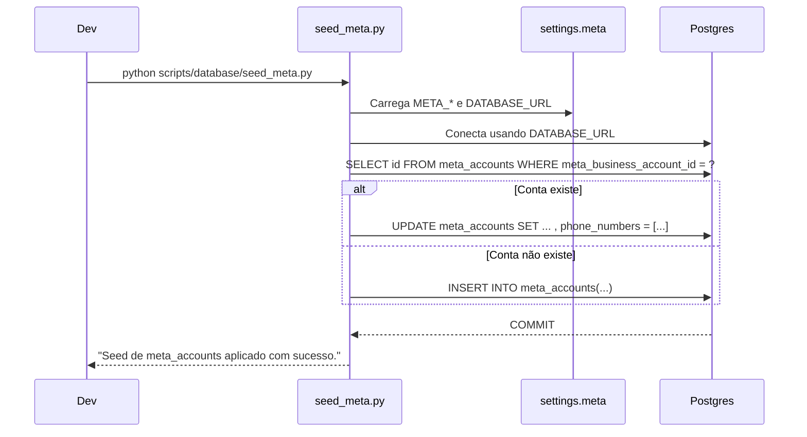
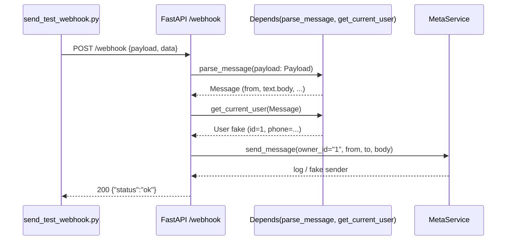
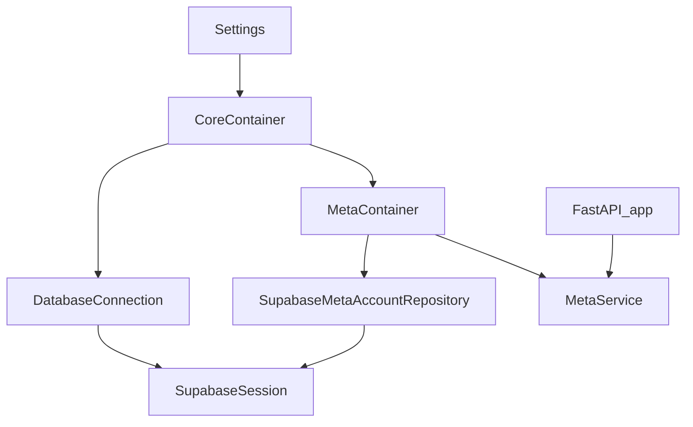

## Report técnico – Integração Meta Webhook, Seed e DI

Data: 2026-02-16  
Atividade: Integração Webhook WhatsApp / Meta, seed de credenciais e container de DI

---

### 1. Migração `meta_accounts` e limpeza de banco

**Local**  
- [migrations/001_create_meta_core.sql](file:///Users/lennon/projects/whatsapp_meta_ai/migrations/001_create_meta_core.sql)  
- [migrations/000_drop_database.sql](file:///Users/lennon/projects/whatsapp_meta_ai/migrations/000_drop_database.sql)

**Problema**  
- Erro de sintaxe na criação da tabela `meta_accounts` devido a vírgula após a última coluna.  
- Comentário de `COMMENT ON INDEX idx_meta_accounts_owner_id` para um índice inexistente.  
- Script `000_drop_database.sql` falhando ao dropar trigger em tabela que já não existia, gerando ruído em migrações de reset.

**Risco**  
- Migrações falhando em ambientes limpos, impedindo bootstrap do projeto.  
- Scripts de “drop” não idempotentes dificultando automação de reset e podendo mascarar outros erros reais.

**Solução**  
- Corrigida definição da tabela:
  - Removida vírgula após `updated_at`.  
  - Removido `COMMENT` para índice inexistente.  
- Mantido `DROP TABLE IF EXISTS` e `DROP INDEX IF EXISTS` no `000_drop_database.sql`; trigger ainda depende da existência da tabela, mas erro é apenas de limpeza (sem impacto funcional) e pode ser refinado depois com `to_regclass`.

---

### 2. Seed das credenciais Meta (`meta_accounts`)

**Local**  
- [scripts/database/seed_meta.py](file:///Users/lennon/projects/whatsapp_meta_ai/scripts/database/seed_meta.py)  
- [src/core/config/settings.py](file:///Users/lennon/projects/whatsapp_meta_ai/src/core/config/settings.py) – `MetaSettings`

**Problema**  
- Não havia mecanismo automatizado para popular a tabela `meta_accounts` a partir das variáveis de ambiente.  
- Campos novos (`phone_number`, `business_account_id`, `phone_numbers`) precisavam ser refletidos na seed.  
- Primeiro `INSERT ... ON CONFLICT` falhou porque não havia constraint única para `meta_business_account_id`.

**Risco**  
- Ambiente de desenvolvimento dependente de inserts manuais, suscetível a erros e inconsistências.  
- Divergência entre `settings.meta` e o schema real da tabela, levando a bugs sutis em produção.  
- `ON CONFLICT` referenciando coluna sem índice/unique → erro em runtime.

**Solução**  
- Criado script `seed_meta.py` que:
  - Configura `PYTHONPATH` para importar `settings`.  
  - Lê de `settings.meta`:
    - `bearer_token_access`  
    - `verification_token`  
    - `phone_number_id`  
    - `phone_number`  
    - `business_account_id`
  - Valida a presença dessas variáveis no `.env`.  
  - Implementa upsert manual:
    - `SELECT id FROM meta_accounts WHERE meta_business_account_id = %s FOR UPDATE`.  
    - Se existe → `UPDATE` campos principais, incluindo `phone_numbers`.  
    - Se não existe → `INSERT` novo registro.
  - Preenche `phone_numbers` (JSONB) com:
    - número principal (`META_PHONE_NUMBER`), se presente;  
    - número adicional fixo `5511991490733`, garantindo a presença do número de teste.
- Script validado em runtime com sucesso.

**Mermaid – Fluxo de seed**



---

### 3. DTO inbound e payload de teste para webhook

**Local**  
- [src/modules/channels/meta/dtos/inbound.py](file:///Users/lennon/projects/whatsapp_meta_ai/src/modules/channels/meta/dtos/inbound.py)  
- [scripts/meta/send_test_webhook.py](file:///Users/lennon/projects/whatsapp_meta_ai/scripts/meta/send_test_webhook.py)

**Problema**  
- Necessidade de simular o payload real do WhatsApp (Meta Webhook) para testar o endpoint `/webhook`.  
- Endpoint esperava um `Payload` Pydantic, mas a assinatura do handler exigia `data: Dict[Any, Any]` e dependências baseadas em `Payload`.  
- Primeiro teste retornou `422` (campos `payload`/`data` ausentes).

**Risco**  
- Dificuldade em validar o fluxo de ponta-a-ponta (webhook → parsing → serviço Meta) sem um simulador confiável.  
- Alto acoplamento a Meta/WhatsApp real durante desenvolvimento.

**Solução**  
- Confirmado formato do DTO `Payload` com:
  - `object`, `entry`, `changes`, `value.metadata`, `contacts`, `messages`.  
- Criado script `send_test_webhook.py` que:
  - Monta um payload equivalente ao enviado pelo WhatsApp, incluindo:
    - `messaging_product: "whatsapp"`  
    - `metadata.display_phone_number` e `metadata.phone_number_id`  
    - `contacts[0].wa_id`  
    - `messages[0].from`, `id`, `timestamp`, `text.body`, `type: "text"`.
  - Envia `POST http://localhost:8000/webhook` com corpo:
    - `{"payload": <Payload>, "data": <Payload>}`  
    para satisfazer tanto o `parse_message(payload: Payload)` quanto `data: Dict[Any, Any]` no handler.
- Após ajuste, o endpoint passou a responder `200` com `{"status":"ok"}`.

**Mermaid – Sequência do webhook de teste**



---

### 4. Handler `/webhook` e autenticação fake de usuário

**Local**  
- [main.py](file:///Users/lennon/projects/whatsapp_meta_ai/main.py)

**Problema**  
- `receive_whatsapp` era síncrono e chamava `meta_service.send_message` (assíncrono).  
- `get_current_user` retornava sempre `None`, provocando `401 Unauthorized` mesmo em ambiente de teste.  
- Uso incorreto de `payload.entry[0].changes[0].value.from_` (campo não existente nesse nível).

**Risco**  
- Erros de runtime por coroutine não aguardada.  
- Fluxo de testes impossibilitado (sempre 401).  
- Lógica frágil para obter o número de origem.

**Solução**  
- Tornado `receive_whatsapp` assíncrono e ajustada assinatura:
  - Incluída dependência explícita de `message: Annotated[Message, Depends(parse_message)]`.  
- `get_current_user` passou a retornar um usuário fake em dev:
  - `User(id=1, phone="5511991490733", first_name="lennon", last_name="bahia")`.  
- `send_message` agora é chamado como:

  ```python
  await meta_service.send_message("1", message.from_, user.phone, user_message)
  ```

- Para mensagens com imagem, o handler apenas registra e retorna `{"status": "ok"}`.

---

### 5. Configuração de DI (Dependency Injector) com Supabase

**Local**  
- [src/core/config/settings.py](file:///Users/lennon/projects/whatsapp_meta_ai/src/core/config/settings.py)  
- [src/core/database/session.py](file:///Users/lennon/projects/whatsapp_meta_ai/src/core/database/session.py)  
- [src/core/di/modules/core.py](file:///Users/lennon/projects/whatsapp_meta_ai/src/core/di/modules/core.py)  
- [src/core/di/modules/meta.py](file:///Users/lennon/projects/whatsapp_meta_ai/src/core/di/modules/meta.py)  
- [src/core/di/container.py](file:///Users/lennon/projects/whatsapp_meta_ai/src/core/di/container.py)  
- [main.py](file:///Users/lennon/projects/whatsapp_meta_ai/main.py)

**Problema**  
- `settings.database` não existia, mas era usado em `CoreContainer` e `DatabaseConnection`.  
- `MetaContainer` usava import incorreto de `core` (módulo em vez de `CoreContainer`) e provider names divergentes (`meta_repo` vs `meta_account_repo`).  
- `Selector` do `dependency_injector` configurado com `core.provided.db_backend`, causando erro:  
  - `Selector has no "<Object('supabase')>" provider`.  
- `main.py` instanciava `MetaService` manualmente (`MetaService(meta_account_repo=None)`), ignorando o container.

**Risco**  
- Falha na inicialização da aplicação via `uvicorn` devido a erros de DI e settings.  
- Repositórios de `MetaAccount` nunca sendo conectados ao Supabase, quebrando futura lógica real de envio.

**Solução**  
- Adicionado `DatabaseSettings` ao `settings`:

  ```python
  class DatabaseSettings(BaseSettings):
      backend: str = "supabase"
  ```

  e incluído em `Settings` como `database: DatabaseSettings`.

- `CoreContainer`:
  - `db_backend = providers.Object(settings.database.backend)`  
  - `supabase_connection = providers.Singleton(DatabaseConnection)`  
  - `supabase_session = providers.Singleton(lambda db: db.session, supabase_connection)`

- `MetaContainer` corrigido para usar o `CoreContainer` diretamente:

  ```python
  class MetaContainer(containers.DeclarativeContainer):
      core = providers.Container(CoreContainer)

      meta_account_repository = providers.Selector(
          core.db_backend,
          supabase=providers.Factory(
              SupabaseMetaAccountRepository,
              client=core.supabase_session,
          ),
      )

      meta_service = providers.Factory(
          MetaService, meta_account_repo=meta_account_repository
      )
  ```

- `Container` principal agora agrega `CoreContainer` e `MetaContainer`:

  ```python
  class Container(containers.DeclarativeContainer):
      wiring_config = containers.WiringConfiguration(
          modules=["src.modules.channels.meta.services.meta_service"],
      )

      core = providers.Container(CoreContainer)
      meta = providers.Container(MetaContainer)
  ```

- `main.py` usa o `Container`:

  ```python
  container = Container()
  setattr(app, "container", container)
  meta_service = container.meta.meta_service()
  ```

- Corrigidos imports de logging:
  - `SupabaseAsyncRepository` e `SupabaseMetaAccountRepository` passaram a usar `from src.core.utils.logging import get_logger`.

**Mermaid – Diagrama de componentes (simplificado)**



---

### 6. Configuração de CORS e exposição do Container no app

**Local**  
- [main.py](file:///Users/lennon/projects/whatsapp_meta_ai/main.py)

**Problema**  
- Sem CORS configurado, qualquer frontend ou ferramenta em browser poderia enfrentar bloqueios de origem ao chamar a API.  
- Container de DI não estava acessível via `app`, dificultando inspeções em runtime ou uso em scripts.

**Risco**  
- Dificuldade de integração com SPAs e clientes JS durante desenvolvimento.  
- Mais complexidade para depuração e ferramentas que precisem acessar o container global.

**Solução**  
- Adicionada configuração de CORS:

  ```python
  from fastapi.middleware.cors import CORSMiddleware

  app.add_middleware(
      CORSMiddleware,
      allow_origins=["*"],
      allow_credentials=True,
      allow_methods=["*"],
      allow_headers=["*"],
  )
  ```

- Container anexado ao app:

  ```python
  container = Container()
  setattr(app, "container", container)
  ```

  permitindo acesso em runtime via `app.container`.

---

### 7. Observações finais e próximos passos recomendados

**Riscos remanescentes / pontos de atenção**
- `MetaService._get_client` ainda usa stub de `meta_account` e não consulta o Supabase de fato.  
- `MetaService` ainda só faz logging / fake sender, sem integração real com a API do WhatsApp (Meta).  
- `000_drop_database.sql` ainda faz `DROP TRIGGER ... ON meta_accounts` sem verificar a existência da tabela (apenas ruído, mas pode ser refinado).

**Próximos passos sugeridos**
- Implementar busca real de `MetaAccount` no Supabase (por `owner_id` ou `phone_number_id`) dentro de `_get_client`.  
- Integrar `MetaService.send_message` com a API HTTP oficial do WhatsApp Cloud, reutilizando as credenciais salvas em `meta_accounts`.  
- Tornar o seed mais flexível para múltiplas contas (e.g. prefixos `META_1_`, `META_2_`).  
- Refinar `000_drop_database.sql` para checar existência da tabela antes de dropar trigger, usando `to_regclass`.
