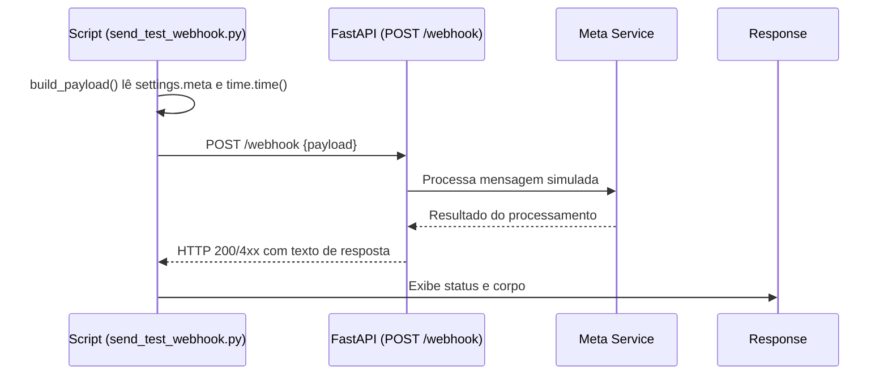
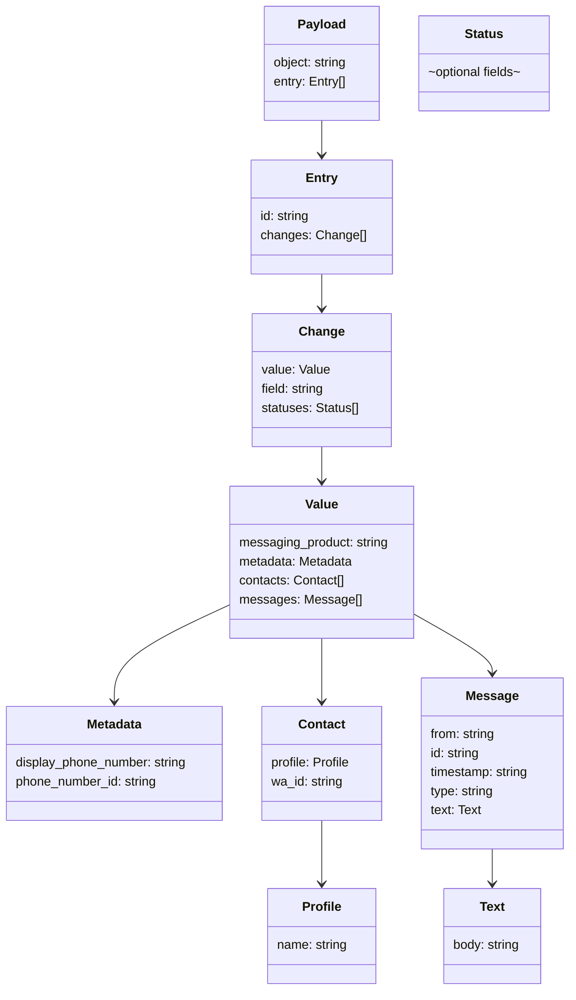

# Report: Ajustes no script de teste de webhook (Meta/WhatsApp)

## Observação
- Local: `scripts/meta/send_test_webhook.py`
- Problema: IDs e timestamp fixos no payload de teste
- Risco: Inconsistência entre ambientes e testes pouco realistas
- Solução: Ler IDs de `settings.meta` e gerar timestamp atual dinamicamente

## Contexto
- O script de teste de webhook simulava eventos do WhatsApp com valores fixos:
  - `WHATSAPP_BUSINESS_ACCOUNT_ID`
  - `PHONE_NUMBER_ID`
  - `timestamp` estático
- Decisão: alinhar o script ao mecanismo de configuração da aplicação via `settings` e assegurar que o timestamp represente o momento da execução.

## Decisões
- Importar a instância global de configurações conforme padrão do projeto: `from src.core.config.settings import settings` <mccoremem id="03flrppo7bl27tnx9ngm5xtvj" />
- Substituir os placeholders por `settings.meta.business_account_id` e `settings.meta.phone_number_id`.
- Converter o timestamp para o epoch atual em segundos (`int(time.time())`) e enviar como string.
- Validar com lint (ruff) para garantir conformidade.

## Correções e Alterações
- Importações atualizadas: [send_test_webhook.py:L1-L3](file:///Users/lennon/projects/whatsapp_meta_ai/scripts/meta/send_test_webhook.py#L1-L3)
- Uso de `business_account_id`: [send_test_webhook.py:L11](file:///Users/lennon/projects/whatsapp_meta_ai/scripts/meta/send_test_webhook.py#L11)
- Uso de `phone_number_id`: [send_test_webhook.py:L18](file:///Users/lennon/projects/whatsapp_meta_ai/scripts/meta/send_test_webhook.py#L18)
- Timestamp dinâmico: [send_test_webhook.py:L30](file:///Users/lennon/projects/whatsapp_meta_ai/scripts/meta/send_test_webhook.py#L30)

## Resultados
- Script passa nas verificações de lint: `ruff check scripts/meta/send_test_webhook.py` → All checks passed!
- Payload de teste agora reflete IDs configurados no ambiente e um timestamp atual.
- Redução de riscos de divergência entre dev/test/prod e aumento de realismo dos eventos simulados.

## Riscos remanescentes
- `display_phone_number` ainda está fixo; pode ser parametrizado via `settings.meta` para ambientes múltiplos.
- Dependência de variáveis de ambiente: é necessário garantir que `business_account_id` e `phone_number_id` estejam definidos em `.env` (ou fonte equivalente). Não armazenar segredos no código.

## Próximos Passos (sugestões)
- Parametrizar `display_phone_number` em `settings.meta`.
- Adicionar tratamento de erro no POST (timeout, status code e logging).
- Introduzir um modo `dry-run` para inspecionar o payload sem enviar requisições.

## Diagrama de Sequência (Webhook de Teste)


## Diagrama de Componentes
```mermaid
graph LR
    subgraph Scripts
        S[send_test_webhook.py]
    end

    subgraph Config
        ST[settings (src.core.config.settings)]
        ENV[.env]
    end

    API[FastAPI /webhook]

    S --> ST
    ST --> ENV
    S --> API
```

## Diagrama de Dados (Estrutura do Payload)


## Considerações Finais
- As mudanças seguem o padrão de importação de `settings` do projeto e mantêm credenciais fora do código fonte, utilizando variáveis de ambiente. <mccoremem id="03flrppo7bl27tnx9ngm5xtvj" />
- O script fica mais robusto, reproduzindo melhor o fluxo real do WhatsApp Webhook e evitando dados estáticos que podem mascarar problemas em ambientes distintos.

