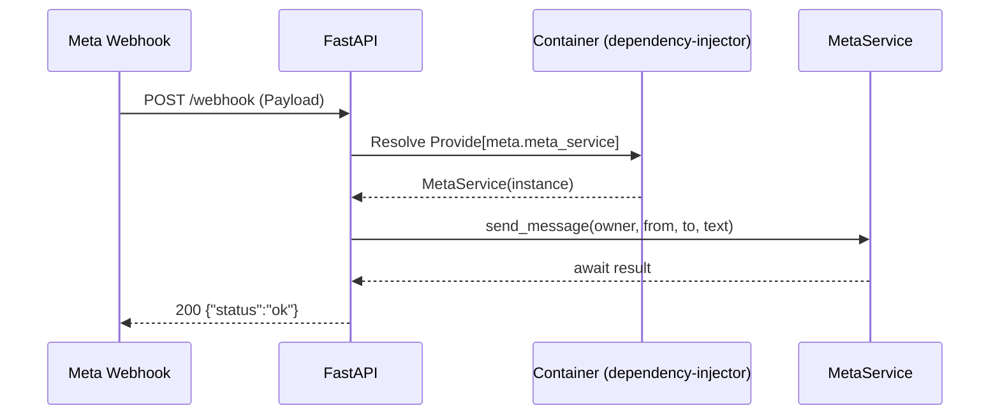
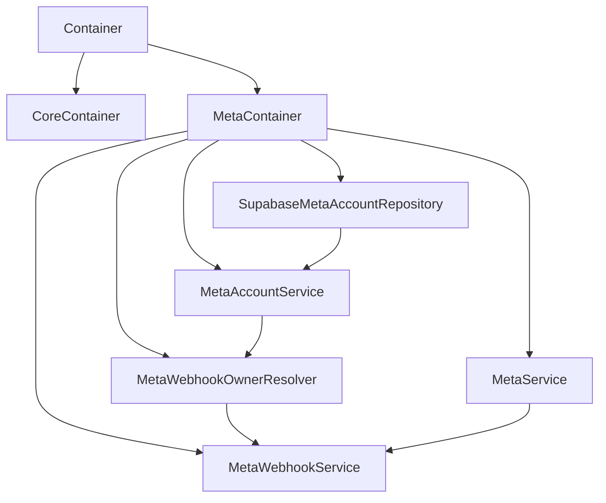
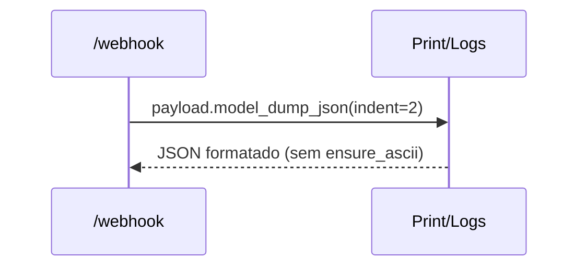
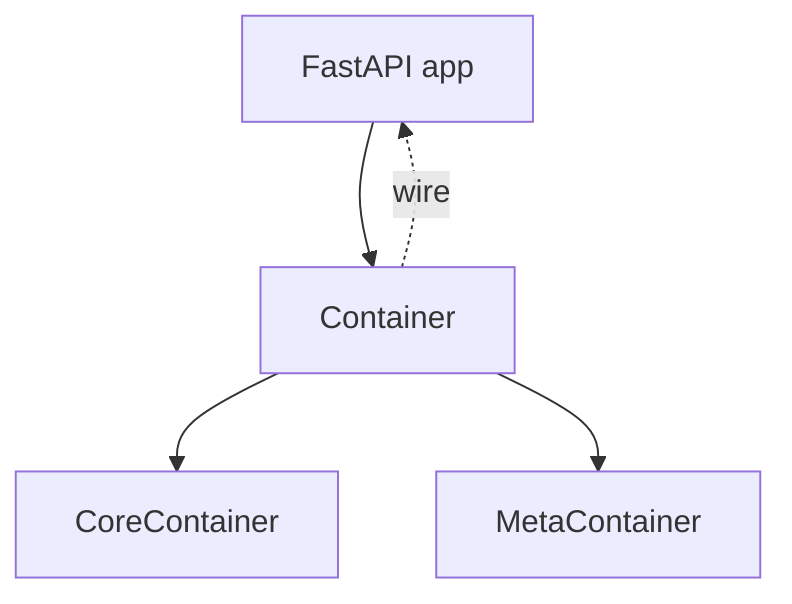

## Report técnico – Ajustes de Dependency Injection e Webhook Meta

Data: 2026-02-18  
Atividade: Injeção de dependências no app, expansão do módulo Meta e correções no webhook

---

### 1) Wiring do Container e injeção do MetaService no endpoint

**Local**  
- [src/main.py](file:///Users/lennon/projects/whatsapp_meta_ai/src/main.py)  
- [src/core/di/container.py](file:///Users/lennon/projects/whatsapp_meta_ai/src/core/di/container.py)

**Problema**  
- O endpoint `/webhook` recebia um objeto `Provide` em vez de uma instância de `MetaService`, resultando em `AttributeError: 'Provide' object has no attribute 'send_message'`.
- O módulo principal não estava “wired” ao container para permitir a resolução de dependências via `Provide`.

**Risco**  
- Erro 500 em produção nos endpoints que dependem de serviços injetados.  
- Aumento de acoplamento ao acessar o container diretamente, prejudicando testabilidade e manutenção.

**Solução**  
- Injetado o serviço via FastAPI + dependency-injector:  
  - Adicionado `@inject` à função do endpoint.  
  - Declarado parâmetro `meta_service: Annotated[MetaService, Depends(Provide[Container.meta.meta_service])]`.  
  - Realizado `container.wire(modules=[__name__])` após criar o `Container` e anexá-lo ao `app`.  
  - Mantido o `Container` único e acessível pelo `app`.

---

### 2) Expansão do MetaContainer (services e pipeline de webhook)

**Local**  
- [src/core/di/modules/meta.py](file:///Users/lennon/projects/whatsapp_meta_ai/src/core/di/modules/meta.py)

**Problema**  
- Serviços auxiliares do fluxo de webhook (ex.: `MetaAccountService`, `MetaWebhookOwnerResolver`, `MetaWebhookService`) não estavam registrados no container.

**Risco**  
- Dificuldade para compor o pipeline do webhook e substituir implementações em testes.  
- Acoplamento e lógica espalhada, reduzindo coesão e clareza do módulo.

**Solução**  
- Registrados providers no `MetaContainer`:
  - `meta_account_service = providers.Factory(MetaAccountService, repo=meta_account_repository)`
  - `meta_webhook_owner_resolver = providers.Factory(MetaWebhookOwnerResolver, meta_account_service=meta_account_service)`
  - `meta_webhook_service = providers.Factory(MetaWebhookService, owner_resolver=meta_webhook_owner_resolver, meta_service=meta_service)`

---

### 3) Serialização do payload em JSON no webhook

**Local**  
- [src/main.py:L182](file:///Users/lennon/projects/whatsapp_meta_ai/src/main.py#L182)

**Problema**  
- Tentativa de uso de `ensure_ascii=False` em `BaseModel.model_dump_json`, o que não é suportado no Pydantic v2, causando `TypeError` e erro 500.

**Risco**  
- Queda do endpoint de webhook e impossibilidade de depurar payloads recebidos.

**Solução**  
- Alterado para `payload.model_dump_json(indent=2)`.  
- Observação: caso seja necessário preservar Unicode sem escapes, pode-se usar `json.dumps(payload.model_dump(), ensure_ascii=False, indent=2)`.

---

### 4) Container principal: módulos wired e acesso via app

**Local**  
- [src/core/di/container.py](file:///Users/lennon/projects/whatsapp_meta_ai/src/core/di/container.py)  
- [src/main.py](file:///Users/lennon/projects/whatsapp_meta_ai/src/main.py)

**Problema**  
- Módulos relevantes não estavam listados no `wiring_config` do container principal.  
- Necessidade de expor o container globalmente para inspeção/controlado durante desenvolvimento.

**Risco**  
- Dependências não resolvidas em runtime.  
- Dificuldade de testes e troubleshooting.

**Solução**  
- `wiring_config` inclui serviços do módulo Meta e `src.main`.  
- `container` é instanciado uma vez e anexado ao `app` via `setattr(app, "container", container)`.

---

### 5) Verificações rápidas

**Local**  
- Execução local via import do módulo principal.

**Problema**  
- Necessidade de garantir que importação do app e resolução de dependências não gerem erro ao carregar.

**Risco**  
- Falhas de inicialização do servidor (uvicorn) por wiring/import incorretos.

**Solução**  
- Teste de importação do módulo `src.main` concluído com sucesso, confirmando wiring básico e ausência de erros de import.

---

### Resultados

- Endpoint `/webhook` injeta corretamente `MetaService` e executa `send_message` sem o erro de `Provide`.  
- Payloads são serializados em JSON válido e legível para depuração.  
- O módulo Meta possui cadeia de serviços registrada no container, tornando o pipeline de webhook testável e extensível.

---

### Próximos Passos Recomendados

- Implementar a resolução real de credenciais no `MetaService._get_client` via Supabase (remover stubs de desenvolvimento).  
- Adicionar testes de integração para o endpoint `/webhook` com o container wired, cobrindo sucesso e erros.  
- Centralizar logs em logger estruturado (substituir prints em produção).  
- Avaliar uso de `Provide` também para outros serviços do projeto, unificando o padrão.

--- 

### Apêndice – Referências de Código

- [main.py](file:///Users/lennon/projects/whatsapp_meta_ai/src/main.py)  
- [container.py](file:///Users/lennon/projects/whatsapp_meta_ai/src/core/di/container.py)  
- [modules/meta.py](file:///Users/lennon/projects/whatsapp_meta_ai/src/core/di/modules/meta.py)

