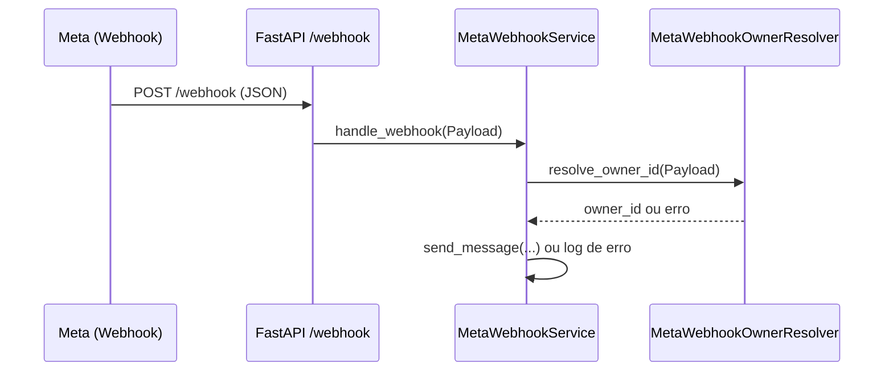
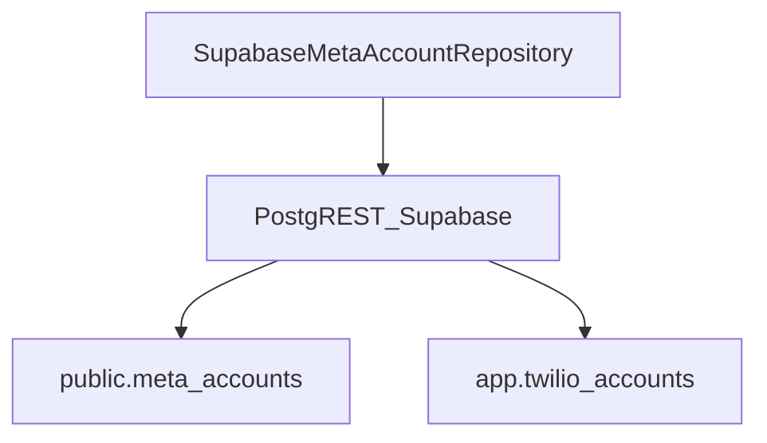
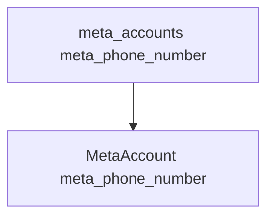
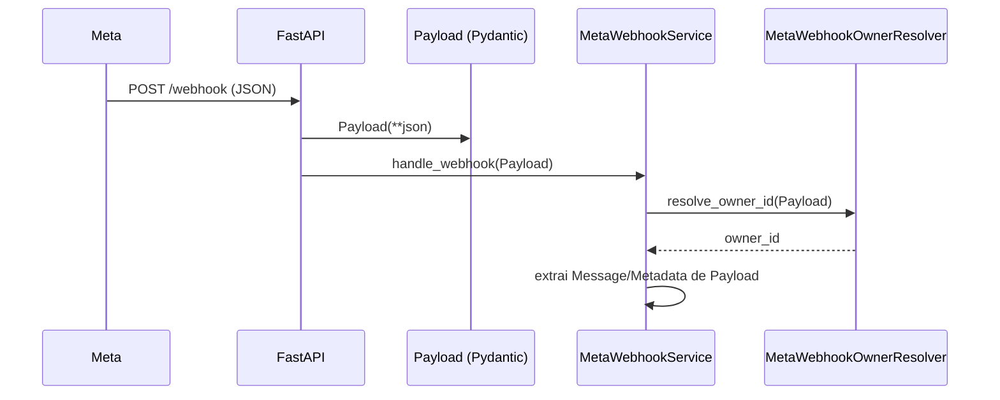
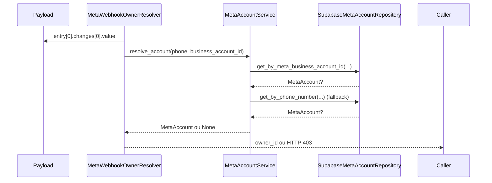
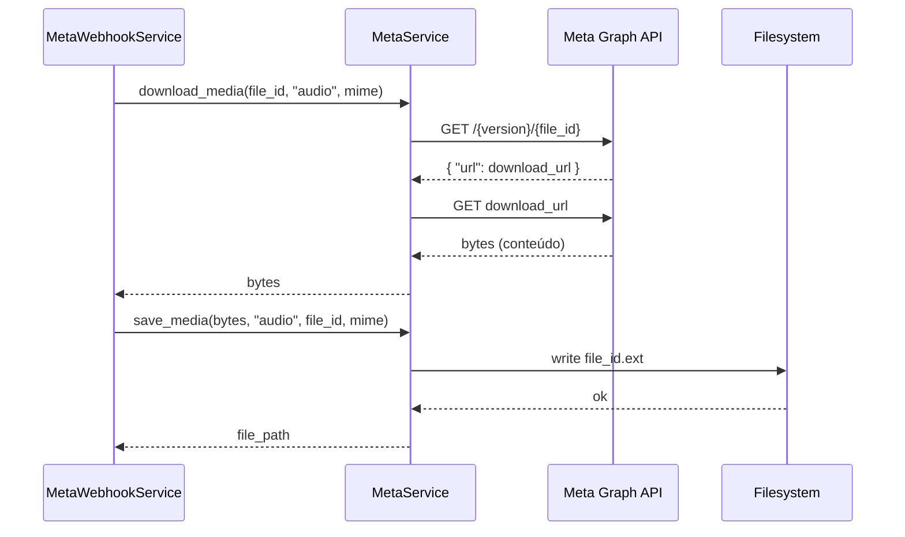

## Report técnico – Debug e refino do Webhook Meta (owner, conta e mídia)

Data: 2026-02-18  
Atividade: Correções no fluxo do webhook Meta, resolução de owner, acesso ao Supabase e download de mídia

---

### 1) Erro de variável não inicializada no MetaWebhookService

**Local**  
- [src/modules/channels/meta/services/meta_webhook_service.py](file:///Users/lennon/projects/whatsapp_meta_ai/src/modules/channels/meta/services/meta_webhook_service.py)  
- [src/main.py](file:///Users/lennon/projects/whatsapp_meta_ai/src/main.py)

**Problema**  
- O método `handle_webhook` fazia:
  - `owner_id = await self.owner_resolver.resolve_owner_id(payload)` dentro de `try`.
  - No `except`, logava `owner_id` mesmo quando a falha ocorria antes da atribuição.  
- Isso gerava `UnboundLocalError: cannot access local variable 'owner_id'` e mascarava o erro real de negócio ou de infra.

**Risco**  
- Logs quebrados escondendo a causa raiz (ex.: erro no resolver, Supabase ou parsing).  
- Dificuldade para debugar incidentes em produção, com erros diferentes do problema original.

**Solução**  
- Removido o uso de `owner_id` no log de exceção:
  - De `logger.error(f"Error sending message via Meta to owner {owner_id}: {e}")`  
  - Para `logger.error(f"Error sending message via Meta webhook: {e}")`.  
- Endpoint `/webhook` passou a enviar o `Payload` (modelo Pydantic) diretamente para o serviço, evitando inconsistência de tipos.

---

### 2) Falha de tabela inexistente no Supabase (meta_accounts)

**Local**  
- [src/modules/channels/meta/repositories/impl/supabase_meta_account_repository.py](file:///Users/lennon/projects/whatsapp_meta_ai/src/modules/channels/meta/repositories/impl/supabase_meta_account_repository.py)  
- [src/core/database/supabase_async_repository.py](file:///Users/lennon/projects/whatsapp_meta_ai/src/core/database/supabase_async_repository.py#L301-L337)  
- [migrations/001_create_meta_core.sql](file:///Users/lennon/projects/whatsapp_meta_ai/migrations/001_create_meta_core.sql)

**Problema**  
- Logs do Supabase mostravam:
  - `PGRST205: Could not find the table 'app.meta_accounts' in the schema cache`, sugerindo `'app.twilio_accounts'`.  
- O repositório `SupabaseMetaAccountRepository` usa `table_name="meta_accounts"`, enquanto as migrações criam `meta_accounts` sem schema explícito (default `public`).  
- O schema de execução do PostgREST/Supabase não enxergava a tabela esperada.

**Risco**  
- Falha ao resolver `MetaAccount` por `business_account_id` ou telefone, impedindo a identificação de owner.  
- Queda silenciosa do fluxo de webhook (logs de erro, mas HTTP 200), gerando perda de eventos ou roteamento incorreto.

**Solução**  
- Confirmada a existência da migração `001_create_meta_core.sql` criando `meta_accounts` com os campos esperados.  
- Ajuste operacional: garantir que:
  - A migração seja aplicada no mesmo banco e schema que o Supabase usa (via `make migrate`).  
  - Ou que a tabela seja criada no schema visualizado pelo PostgREST (ex.: `app.meta_accounts`).  
- Código do repositório permanece usando `table_name="meta_accounts"`, alinhado ao SQL.

---

### 3) Inconsistência entre schema da tabela e modelo MetaAccount (phone_number vs meta_phone_number)

**Local**  
- [src/modules/channels/meta/models/meta_account.py](file:///Users/lennon/projects/whatsapp_meta_ai/src/modules/channels/meta/models/meta_account.py)  
- [migrations/001_create_meta_core.sql](file:///Users/lennon/projects/whatsapp_meta_ai/migrations/001_create_meta_core.sql#L3-L15)  
- [scripts/database/seed_meta.py](file:///Users/lennon/projects/whatsapp_meta_ai/scripts/database/seed_meta.py)

**Problema**  
- A tabela `meta_accounts` possui a coluna `meta_phone_number`.  
- O modelo Pydantic `MetaAccount` exigia o campo obrigatório `phone_number`.  
- Ao carregar registros via Supabase, ocorria erro de validação:
  - `1 validation error for MetaAccount\nphone_number\n  Field required...`.

**Risco**  
- Impossibilidade de materializar `MetaAccount` em memória, mesmo com dados corretos no banco.  
- Qualquer fluxo que dependa de `MetaAccount` falharia na camada de modelagem (Pydantic), gerando exceções em runtime.

**Solução**  
- Alinhado o modelo ao schema real:
  - `phone_number` → `meta_phone_number` (campo obrigatório, `str`).  
  - Atualizado `__repr__` para refletir o novo nome.  
- Com isso, o dicionário retornado pelo Supabase bate com o modelo, eliminando o erro de validação.

---

### 4) Correção do tipo do payload no fluxo de webhook (dict vs Payload)

**Local**  
- [src/main.py](file:///Users/lennon/projects/whatsapp_meta_ai/src/main.py#L142-L151)  
- [src/modules/channels/meta/dtos/inbound.py](file:///Users/lennon/projects/whatsapp_meta_ai/src/modules/channels/meta/dtos/inbound.py)  
- [src/modules/channels/meta/services/meta_webhook_service.py](file:///Users/lennon/projects/whatsapp_meta_ai/src/modules/channels/meta/services/meta_webhook_service.py)  
- [src/modules/channels/meta/services/webhook/owner_resolver.py](file:///Users/lennon/projects/whatsapp_meta_ai/src/modules/channels/meta/services/webhook/owner_resolver.py)

**Problema**  
- O endpoint `/webhook` recebia `payload: Payload` (Pydantic) mas repassava `payload.model_dump()` para `handle_webhook`.  
- Dentro do serviço:
  - Havia acesso misto: `payload["entry"][0]` (como dict) e `payload.entry[0]` (como modelo).  
- Isso causava erros como:  
  - `'dict' object has no attribute 'entry'`.

**Risco**  
- Fluxo de webhook quebrando em produção dependendo da forma como o payload é acessado.  
- Dificuldade de evolução dos DTOs (`Payload`, `Message`, etc.) por causa de uso inconsistente de tipos.

**Solução**  
- Padronizado o uso de `Payload` (modelo Pydantic) em todo o fluxo:
  - `main.py`: `await meta_webhook_service.handle_webhook(payload)` (sem `.model_dump()` na chamada).  
  - `MetaWebhookService.handle_webhook` e `MetaWebhookOwnerResolver.resolve_owner_id` passaram a usar apenas acesso via atributos (`payload.entry[0].changes[0].value...`).  
- Extração de texto e metadados feita diretamente via DTOs (`Message`, `Metadata`), sem indexação em dict.

---

### 5) Resolução do owner via MetaWebhookOwnerResolver e MetaAccountService

**Local**  
- [src/modules/channels/meta/services/webhook/owner_resolver.py](file:///Users/lennon/projects/whatsapp_meta_ai/src/modules/channels/meta/services/webhook/owner_resolver.py)  
- [src/modules/channels/meta/services/meta_account_service.py](file:///Users/lennon/projects/whatsapp_meta_ai/src/modules/channels/meta/services/meta_account_service.py)  
- [src/modules/channels/meta/repositories/impl/supabase_meta_account_repository.py](file:///Users/lennon/projects/whatsapp_meta_ai/src/modules/channels/meta/repositories/impl/supabase_meta_account_repository.py)

**Problema**  
- O resolver acessava o payload como dict e com chaves fixas, além de usar o `id` da entry diretamente.  
- A resolução de conta dependia da tabela `meta_accounts`, antes inconsistente com o modelo e possivelmente em schema diferente.

**Risco**  
- Falha em encontrar o owner para o número/biz ID recebido, gerando `HTTPException(403)` ou logs de erro.  
- Bloqueio do fluxo de qualquer mensagem que dependa de roteamento por owner.

**Solução**  
- Resolver reescrito para operar sobre o DTO `Payload`:
  - `entry = payload.entry[0]`  
  - `change = entry.changes[0]`  
  - `value = change.value`  
  - `business_account_id = entry.id`  
  - `display_phone_number = value.metadata.display_phone_number`  
- `MetaAccountService.resolve_account` usa:
  - `repo.get_by_meta_business_account_id(business_account_id)` quando houver biz ID.  
  - `repo.get_by_phone_number(phone_number)` como fallback por telefone.  
  - Fallback para `settings.meta.business_account_id` em ambiente de desenvolvimento.  
- Em caso de falha, o resolver loga com contexto e responde `HTTPException(403)` com mensagem clara.

---

### 6) Refatoração de download e persistência de mídia (download_media e save_media)

**Local**  
- [src/modules/channels/meta/services/meta_service.py](file:///Users/lennon/projects/whatsapp_meta_ai/src/modules/channels/meta/services/meta_service.py#L104-L146)  
- [src/modules/channels/meta/services/meta_webhook_service.py](file:///Users/lennon/projects/whatsapp_meta_ai/src/modules/channels/meta/services/meta_webhook_service.py#L40-L77)

**Problema**  
- `download_media` fazia duas responsabilidades:
  - Buscar URL de download na API da Meta e baixar o conteúdo.  
  - Escrever o arquivo em disco e devolver o path.  
- No webhook, já existia a intenção de chamar `save_media(content, ...)`, mas essa função ainda não existia na implementação de `MetaService`.

**Risco**  
- Acoplamento forte entre lógica de rede (httpx) e I/O local, dificultando testes e mudanças (mudança de storage, por exemplo).  
- Duplicação ou inconsistência no tratamento de mídia para áudio e vídeo.

**Solução**  
- `download_media` passou a:
  - Consultar a API da Meta (dois GETs: metadados e conteúdo).  
  - Retornar `bytes | None` (`response.content`) para tipos `"image"`, `"audio"`, `"video"`.  
- Criada `save_media(content, file_type, file_id, mime_type)`:
  - Calcula a extensão pelo `mime_type`.  
  - Escreve o arquivo `<file_id>.<ext>` no diretório atual.  
  - Retorna `file_path` apenas para tipos suportados.  
- Ajustado `MetaWebhookService`:
  - Áudio: baixa com `download_media`, salva via `save_media` e loga o path.  
  - Vídeo: segue o mesmo padrão, reaproveitando as duas funções.

---

### Resultados

- Fluxo do webhook Meta agora:
  - Recebe e trata `Payload` de forma consistente, sem mistura de `dict` e modelo.  
  - Resolve corretamente o owner via `MetaAccount` armazenado em `meta_accounts`.  
  - Loga erros reais (Supabase, validação, HTTP) sem ser mascarado por `UnboundLocalError`.  
- O modelo `MetaAccount` está alinhado ao schema real da tabela, eliminando erros de validação Pydantic.  
- A lógica de download de mídia foi separada em responsabilidades claras (`download_media` e `save_media`), facilitando evolução futura (como mover storage para S3 ou similar).

---

### Próximos Passos Recomendados

- Implementar em `MetaService._get_client` a busca real de credenciais no Supabase (usando `MetaAccountRepository`) em vez do stub atual.  
- Introduzir testes de integração para o fluxo completo `/webhook`:
  - Casos de texto, imagem, áudio e vídeo.  
  - Casos de erro: owner inexistente, meta_accounts ausente, falha de download de mídia.  
- Parametrizar diretório de armazenamento de mídia (ex.: via `settings`), evitando salvar na raiz do projeto em produção.  
- Introduzir camada de transcrição para áudio (Whisper etc.) aproveitando os bytes retornados por `download_media`.

---

### Apêndice – Referências de Código

- [main.py](file:///Users/lennon/projects/whatsapp_meta_ai/src/main.py)  
- [meta_webhook_service.py](file:///Users/lennon/projects/whatsapp_meta_ai/src/modules/channels/meta/services/meta_webhook_service.py)  
- [webhook/owner_resolver.py](file:///Users/lennon/projects/whatsapp_meta_ai/src/modules/channels/meta/services/webhook/owner_resolver.py)  
- [meta_account_service.py](file:///Users/lennon/projects/whatsapp_meta_ai/src/modules/channels/meta/services/meta_account_service.py)  
- [meta_account.py](file:///Users/lennon/projects/whatsapp_meta_ai/src/modules/channels/meta/models/meta_account.py)  
- [supabase_meta_account_repository.py](file:///Users/lennon/projects/whatsapp_meta_ai/src/modules/channels/meta/repositories/impl/supabase_meta_account_repository.py)  
- [supabase_async_repository.py](file:///Users/lennon/projects/whatsapp_meta_ai/src/core/database/supabase_async_repository.py)  
- [meta_service.py](file:///Users/lennon/projects/whatsapp_meta_ai/src/modules/channels/meta/services/meta_service.py)
