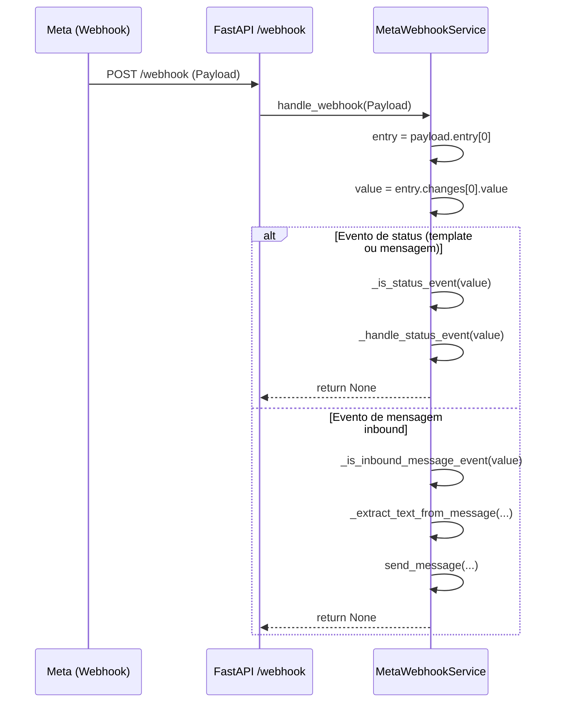
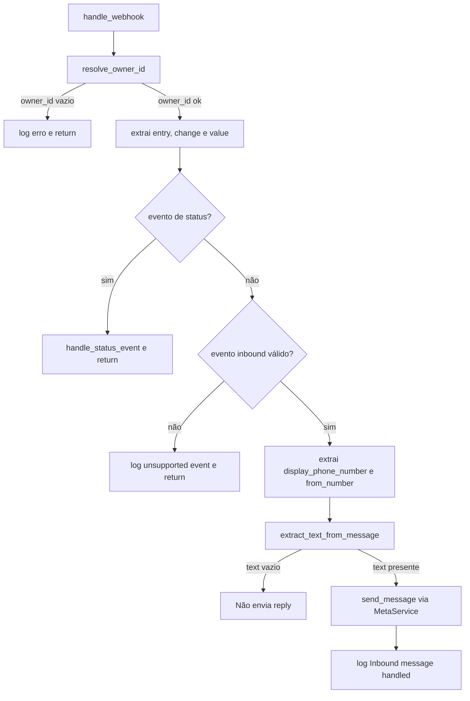
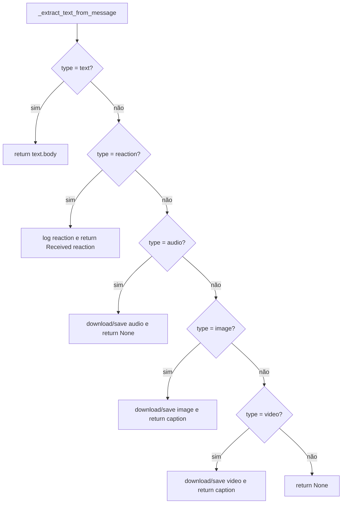

## Report técnico – Fluxo de webhook Meta (status de template vs mensagem inbound)

Data: 2026-02-19  
Atividade: Correção do erro em webhooks de status (template) e clareza do fluxo mensagem vs status no `MetaWebhookService`

---

### 1) Erro `'NoneType' object is not subscriptable` em webhook de status (envio de template)

**Local**  
- [src/modules/channels/meta/services/meta_webhook_service.py](file:///Users/lennon/projects/whatsapp_meta_ai/src/modules/channels/meta/services/meta_webhook_service.py)  
- Endpoint que delega para o `MetaWebhookService.handle_webhook` (Fluxo principal de webhook Meta)  

**Problema**  
- Durante o envio de um **template** pelo WhatsApp Cloud, o Meta disparou um webhook de **status** com payload semelhante a:
  - `contacts: null`  
  - `messages: null`  
  - `statuses: [ { id, status: "delivered", ... } ]`
- O código original do `MetaWebhookService` assumia que sempre haveria:
  - `value.contacts[0].wa_id`  
  - `value.messages[0]`
- Em eventos de status, `value.contacts` e `value.messages` vêm como `None`.  
- Ao tentar acessar `value.contacts[0]`, o Python disparava:

  ```text
  TypeError: 'NoneType' object is not subscriptable
  ```

**Risco**  
- Quebra do fluxo de webhook para qualquer evento de status (incluindo confirmações de envio de template).  
- Logs de erro pouco claros sobre a natureza do evento (status vs mensagem), dificultando o entendimento da origem do webhook.  
- Possível impacto em comportamento futuro caso o código tentasse responder a eventos que não deveriam gerar reply (como status de template).  

**Solução**  
- Reestruturado o `handle_webhook` para separar explicitamente:
  - **Eventos de status** (incluindo status de template).
  - **Eventos de mensagem inbound** (texto, reação, mídia etc.).  
- Extração de `entry`, `change` e `value` centralizada:

  ```python
  entry = payload.entry[0]
  change = entry.changes[0]
  value = change.value
  ```

- Criadas funções auxiliares para tornar a regra de roteamento explícita:

  ```python
  def _is_status_event(self, value):
      return (not value.messages or len(value.messages) == 0) and bool(value.statuses)

  def _handle_status_event(self, value):
      status = value.statuses[0]
      logger.info(f"Status update: {status.status} for message {status.id}")

  def _is_inbound_message_event(self, value):
      if not value.messages or len(value.messages) == 0:
          return False
      if not value.contacts or len(value.contacts) == 0:
          logger.error("Missing contacts in payload for message event")
          return False
      return True
  ```

- Novo fluxo em `handle_webhook`:
  - Se `_is_status_event(value)` → apenas loga o status e retorna, sem tentar acessar `contacts`/`messages` e sem enviar resposta.  
  - Se **não** é status, mas também não é `_is_inbound_message_event` → loga como evento não suportado e retorna.  
  - Apenas quando é evento inbound válido, extrai `display_phone_number`, `from_number` e delega para `_extract_text_from_message`.  



---

### 2) Clareza do fluxo: status vs mensagem inbound no `MetaWebhookService`

**Local**  
- [src/modules/channels/meta/services/meta_webhook_service.py](file:///Users/lennon/projects/whatsapp_meta_ai/src/modules/channels/meta/services/meta_webhook_service.py)  

**Problema**  
- O método `handle_webhook` tinha múltiplas responsabilidades e verificações inline:
  - Acesso direto a `payload.entry[0].changes[0].value`.  
  - Tratamento misturado de texto, reação, áudio, imagem e vídeo.  
  - Lógica de fluxo (status vs mensagem) implícita em `if value.messages` e uso de `contacts`.  
- Com o erro de `NoneType`, a causa raiz estava ligada justamente à falta de clareza sobre:
  - Quando o webhook representa **apenas status** (como em envio de template).  
  - Quando representa uma **mensagem inbound** (usuário enviando texto ou mídia).  

**Risco**  
- Dificuldade para dar manutenção e evoluir o fluxo para novos tipos de eventos Meta.  
- Alto risco de novos bugs ao adicionar tratamento para outros tipos de webhook.  
- Dificuldade para auditar e logar corretamente o caminho seguido por cada tipo de evento.  

**Solução**  
- Refatorado `handle_webhook` para seguir um fluxo de alto nível:

  ```python
  async def handle_webhook(self, payload: Payload):
      logger.info(f"Meta Webhook received: {payload}")

      owner_id = await self.owner_resolver.resolve_owner_id(payload)
      if not owner_id:
          logger.error(f"Owner lookup failed for payload: {payload}")
          return None

      entry = payload.entry[0]
      change = entry.changes[0]
      value = change.value

      if self._is_status_event(value):
          self._handle_status_event(value)
          return None

      if not self._is_inbound_message_event(value):
          logger.info(f"Unsupported webhook event: {value}")
          return None

      display_phone_number = value.metadata.display_phone_number
      from_number = value.contacts[0].wa_id

      text = await self._extract_text_from_message(
          value,
          owner_id,
          from_number,
          display_phone_number,
      )

      if text:
          await self.meta_service.send_message(
              owner_id=owner_id,
              from_number=from_number,
              to_number=display_phone_number,
              message=text,
              media_type=value.messages[0].type,
          )
          logger.info(
              f"Inbound message handled: reply sent from {from_number} to "
              f"{display_phone_number} for owner {owner_id}"
          )
  ```

- Com isso, o código expressa claramente:
  - **Primeiro**: resolve o owner.  
  - **Depois**: identifica se é **status** ou **mensagem inbound**.  
  - **Por último**: extrai o conteúdo e, se houver texto, responde via `MetaService`.  



---

### 3) Extração de texto e tratamento de mídia em `_extract_text_from_message`

**Local**  
- [src/modules/channels/meta/services/meta_webhook_service.py – `_extract_text_from_message`](file:///Users/lennon/projects/whatsapp_meta_ai/src/modules/channels/meta/services/meta_webhook_service.py#L71-L139)  

**Problema**  
- A lógica de tratamento de tipos de mensagem (`text`, `reaction`, `audio`, `image`, `video`) estava toda embutida no método principal, dificultando:
  - Reuso.  
  - Entendimento de quais tipos realmente geram texto de reply.  
  - Evolução futura para novos tipos (por exemplo, documentos, localização).  
- Havia também um risco de inconsistência na manipulação de mídia; por exemplo, o código anterior usava `video_id` em alguns pontos de imagem.  

**Risco**  
- Crescimento descontrolado do método principal de webhook.  
- Bugs sutis na manipulação de mídia (IDs trocados, paths errados).  
- Dificuldade em plugar novas capacidades (como transcrição de áudio) sem gerar regressões.  

**Solução**  
- Criado método dedicado:

  ```python
  async def _extract_text_from_message(
      self,
      value,
      owner_id: str,
      from_number: str,
      display_phone_number: str,
  ) -> str | None:
      first_message: Message = value.messages[0]

      if first_message.type == "text" and first_message.text:
          return first_message.text.body

      if first_message.type == "reaction" and first_message.reaction:
          emoji = first_message.reaction.emoji
          logger.info(
              f"Reaction received: {emoji} on message {first_message.reaction.message_id}"
          )
          return f"Received reaction: {emoji}"

      if first_message.type == "audio" and first_message.audio:
          audio_id = first_message.audio.id
          logger.info(
              f"Audio ID: {audio_id}, MIME Type: {first_message.audio.mime_type}"
          )
          audio_bytes = await self.meta_service.download_media(
              audio_id, "audio", first_message.audio.mime_type
          )
          if audio_bytes:
              audio_path = await self.meta_service.save_media(
                  audio_bytes,
                  "audio",
                  audio_id,
                  first_message.audio.mime_type,
              )
              logger.info(f"Audio downloaded: {audio_path}")
          return None

      if first_message.type == "image" and first_message.image:
          image_id = first_message.image.id
          caption = first_message.image.caption
          logger.info(f"Image ID: {image_id}, Caption: {caption}")
          image_bytes = await self.meta_service.download_media(
              image_id, "image", first_message.image.mime_type
          )
          if image_bytes:
              image_path = await self.meta_service.save_media(
                  image_bytes,
                  "image",
                  image_id,
                  first_message.image.mime_type,
              )
              logger.info(f"Image downloaded: {image_path}, caption: {caption}")
          return caption

      if first_message.type == "video" and first_message.video:
          video_id = first_message.video.id
          caption = first_message.video.caption
          logger.info(f"Video ID: {video_id}, Caption: {caption}")
          video_bytes = await self.meta_service.download_media(
              video_id, "video", first_message.video.mime_type
          )
          if video_bytes:
              video_path = await self.meta_service.save_media(
                  video_bytes,
                  "video",
                  video_id,
                  first_message.video.mime_type,
              )
              logger.info(f"Video downloaded: {video_path}, caption: {caption}")
          return caption

      return None
  ```

- Padrões definidos:
  - **Texto**: retorna o `body` para reply.  
  - **Reação**: retorna uma string descritiva, caso desejado.  
  - **Áudio**: apenas baixa e salva, não gera texto (futuro: transcrição).  
  - **Imagem/Vídeo**: baixa, salva e usa a caption, se existir, como texto de reply.  



---

### 4) Log de envio de resposta inbound mais descritivo

**Local**  
- [src/modules/channels/meta/services/meta_webhook_service.py – trecho de envio de resposta](file:///Users/lennon/projects/whatsapp_meta_ai/src/modules/channels/meta/services/meta_webhook_service.py#L38-L51)  

**Problema**  
- O log de envio de resposta era genérico:

  ```python
  logger.info(f"Message sent successfully to {display_phone_number}")
  ```

- Com o novo fluxo (status vs inbound), esse log não deixava claro:
  - Que se tratava de uma **mensagem inbound** sendo respondida.  
  - Quem era o remetente e o owner associado.  

**Risco**  
- Logs menos úteis para auditoria e troubleshooting, principalmente em cenários com múltiplos owners / números.  

**Solução**  
- Atualizado o log após o `send_message` para incluir contexto completo:

  ```python
  logger.info(
      f"Inbound message handled: reply sent from {from_number} to "
      f"{display_phone_number} for owner {owner_id}"
  )
  ```

- Isso torna explícito:
  - Origem (`from_number`) – número do usuário.  
  - Destino (`display_phone_number`) – número do bot/conta.  
  - Owner responsável (`owner_id`).  
  - Que é um fluxo de **mensagem inbound tratada**, distinto de eventos de status.  

---

### Considerações finais

- O fluxo de webhook Meta agora diferencia claramente:
  - **Eventos de status** (incluindo status de templates) → apenas logados, sem tentativa de resposta.  
  - **Eventos de mensagem inbound** → processados via `_extract_text_from_message` e, quando apropriado, respondidos com `send_message`.  
- A refatoração reduz o risco de erros como `'NoneType' object is not subscriptable` e deixa o código pronto para evoluir com:
  - Novos tipos de mensagens.  
  - Transcrição de áudio.  
  - Enriquecimento de métricas e observabilidade por tipo de evento.  
